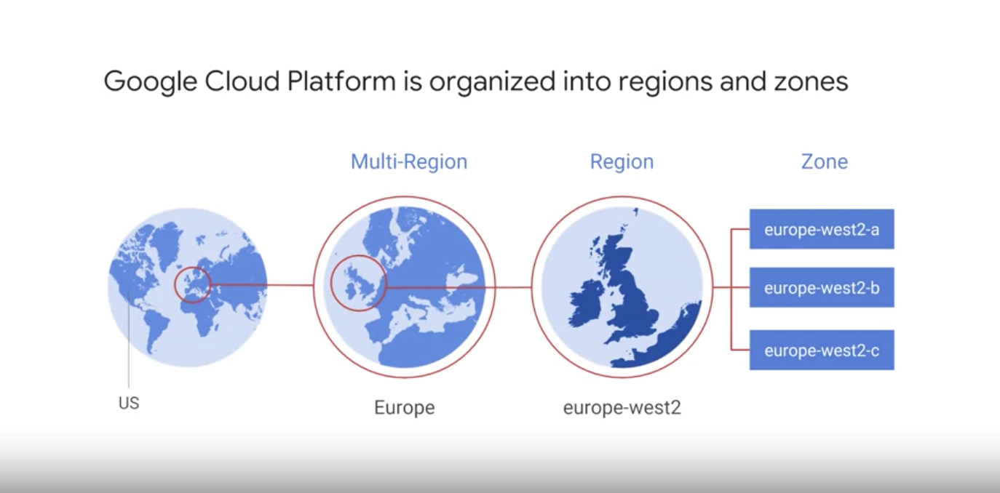

# Google Cloud Zones

GCP is present in 24 regions, divided into 73 zones, in 144 locations and available in more than 200 countries

### Regions vs Zones vs Edge locations

GCP is organized into regions and zones...

Regions are independent geographic areas that consist of zones. Zones and regions are logical abstractions of underlying physical resources provided in one or more physical data centers. These data centers may be owned by Google and listed on the Google Cloud locations page or leased from third-party data center providers. Regardless of whether the data center is owned or leased, Google Cloud selects data centers and designs their infrastructure to provide a uniform level of performance, security and reliability.

A zone is an area where Google Cloud resources are deployed within a region. Zones should be considered a single fault domain within a region. To deploy fault-tolerant applications with high availability and help protect against unexpected failures, deploy your applications across multiple zones within a region.

To protect against the loss of an entire region due to a natural disaster, have a disaster recovery plan in place and know how to access your application in the unlikely event that you lose your primary region. See Application Deployment Considerations for more information.

Google Cloud services and features can be zonal, regional, or managed by Google in multiple regions. For more information on what these options mean for your data, see Geographic Data Management.

