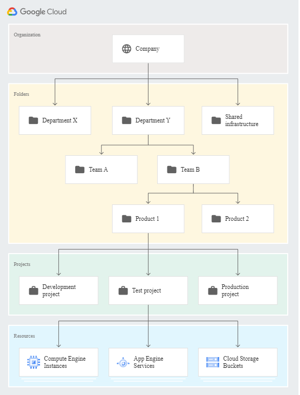

# Resource hierarchy 

The purpose of the Google Cloud resource hierarchy is two-fold:

- Provide a hierarchy of ownership, which binds the lifecycle of a resource to its immediate parent in the hierarchy.
- Provide attach points and inheritance for access control and organization policies.

Metaphorically speaking, the Google Cloud resource hierarchy resembles the file system found in traditional operating systems as a way of organizing and managing entities hierarchically. Each resource has exactly one parent. This hierarchical organization of resources enables you to set access control policies and configuration settings on a parent resource, and the policies and Identity and Access Management (IAM) settings are inherited by the child resources.

## Google Cloud resource hierarchy in detail

At the lowest level, resources are the fundamental components that make up all Google Cloud services. Examples of resources include Compute Engine Virtual Machines (VMs), Pub/Sub topics, Cloud Storage buckets, App Engine instances. All these lower level resources can only be parented by projects, which represent the first grouping mechanism of the Google Cloud resource hierarchy.

Google Workspace and Cloud Identity customers have access to additional features of the Google Cloud resource hierarchy that provide benefits such as centralized visibility and control, and further grouping mechanisms, such as folders

Google Cloud resources are organized hierarchically. Starting from the bottom of the hierarchy, projects are the first level, and they contain other resources. All resources except for organizations have exactly one parent. The Organization is the top of the hierarchy and does not have a parent.

The Organization resource is the root node of the Google Cloud resource hierarchy and all resources that belong to an organization are grouped under the organization node. This provides central visibility and control over every resource that belongs to an organization.

Folders are an additional grouping mechanism on top of projects. You are required to have an Organization resource as a prerequisite to use folders. Folders and projects are all mapped under the Organization resource.

The Google Cloud resource hierarchy, especially in its most complete form which includes an Organization resource and folders, allows companies to map their organization onto Google Cloud and provides logical attach points for access management policies (IAM) and Organization policies. Both IAM and Organization policies are inherited through the hierarchy, and the effective policy at each node of the hierarchy is the result of policies directly applied at the node and policies inherited from its ancestors.

The diagram below represents an example Google Cloud resource hierarchy in complete form:

    

## The Organization resource

The Organization resource represents an organization (for example, a company) and is the root node in the Google Cloud resource hierarchy. The Organization resource is the hierarchical ancestor of project resources and Folders. The IAM access control policies applied on the Organization resource apply throughout the hierarchy on all resources in the organization.

Google Cloud users are not required to have an Organization resource, but some features of Resource Manager will not be usable without one. The Organization resource is closely associated with a Google Workspace or Cloud Identity account. When a user with a Google Workspace or Cloud Identity account creates a Google Cloud Project, an Organization resource is automatically provisioned for them.

A Google Workspace or Cloud Identity account can have exactly one Organization provisioned with it. Once an Organization resource is created for a domain, all Google Cloud projects created by members of the account domain will by default belong to the Organization resource. When a managed user creates a project, the requirement is that it must be in some organization. If a user specifies an organization and they have the right permissions, the project is assigned to that organization. Otherwise, it will default to the organization the user is associated with. It is impossible to create a project that isn't associated with an organization.

## Benefits of the Organization resource
 
With an Organization resource, projects belong to your organization instead of the employee who created the project. This means that the projects are no longer deleted when an employee leaves the company; instead they will follow the organization’s lifecycle on Google Cloud.

Furthermore, organization administrators have central control of all resources. They can view and manage all of your company's projects. This enforcement means that there can no longer be shadow projects or rogue admins.

Also, you can grant roles at the organization level, which are inherited by all projects and folders under the Organization resource. For example, you can grant the Network Admin role to your networking team at the organization level, allowing them to manage all the networks in all projects in your company, instead of granting them the role for all individual projects.